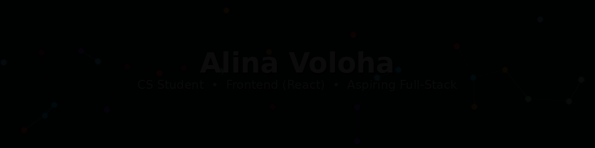

  <picture>
    <source media="(prefers-color-scheme: dark)" srcset="./profile.gif">
    <source media="(prefers-color-scheme: light)" srcset="./profile_light.gif">
    
  </picture>

  <b>CS Student</b> • <b>Frontend Developer (React)</b> • <b>Aspiring Full-Stack Developer</b>

  <a href="https://t.me/alinavoloha">Telegram</a> •
  <a href="https://linkedin.com/in/alina-volokha">LinkedIn</a> •
  <a href="mailto:alinavalokha@gmail.com">alinavalokha@gmail.com</a>

---

### Focus
- 📍 Based in Belarus • Target role: **Frontend Developer**
- 🧠 I enjoy turning messy requirements into clean structure: UI + logic + maintainable code
- 👥 Team lead experience (3 people): planning, estimation, sprint workflow, quality control, demos

---

### Open to
- Frontend roles in Belarus  
- Open to a part-time internship (flexible schedule) with a transition into a full-time role.

---

## Tech Stack

**Frontend**
  

**Backend / Languages**
  

**Tools**
  

**Workflow**
  

---

## Featured Projects

**Full-Stack / Mobile** 

 (in progress)

**Frontend Practice** 

**Other languages**  

**Navigation** 

  
  
<b>Highlights</b>

- ✅ Built UI from Figma to pixel-perfect layout (landing pages, responsive screens)
- 🗺️ Implemented interactive UI features (image map with clickable zones and links)
- 🌐 Worked with APIs (fetch/axios): loading states, offline handling, error cases (404, no connection)
- 🧩 Refactored and fixed a complex codebase (1000+ lines) and made it work reliably
- 👥 Led a 3-person team using Scrum/Kanban practices: planning, estimation, burndown, retrospectives

---

## Stats

  
  

